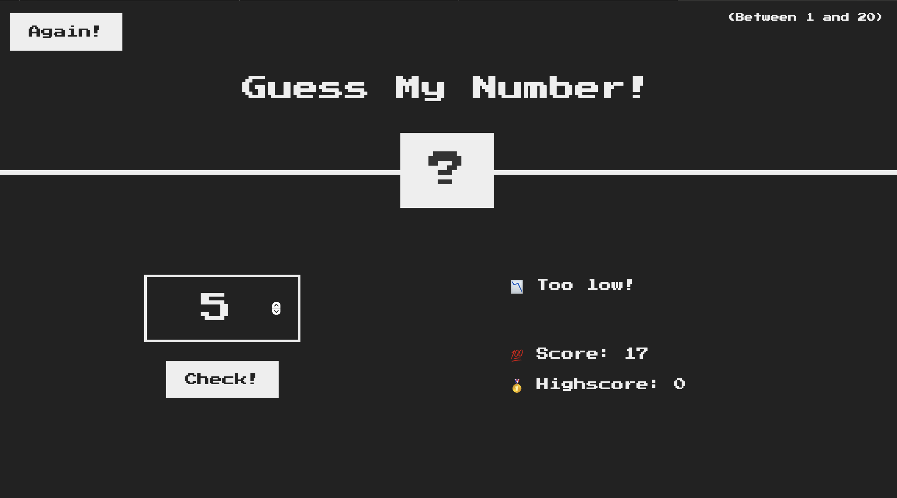

# **Guess-my-number**

A simple and fun guessing game built with HTML, CSS, and JavaScript. In this game, the player tries to guess a secret number between 1 and 20. The game provides feedback on whether the guess is too high or too low, and keeps track of the player's score and highscore.

## **FEATURES**
- Randomly generated number between 1 and 20.
- User input for guessing the number
- Dynamic feedback messages
- Score tracking and highscore recording
- Option to restart the game at any time with the "Again!" button.

## **TECH-STACK**
- HTML
- CSS
- JavaScript

## **HOW TO PLAY**

Let's say 15, then you click Check! 
And then on the right side you get a message. In this case it says, that your guess was Too high!

Also you can see that you started with a Score of 20 and now after one failed guess it decreased to 19.
So basically after each guess that you fail, the score decreases by one.

Let's try 5, now it's too low. So we get a different message.

when you get the number correct this "Correct number!" message is displayed and screen turns green
and also you now have the Highscore of 16.

Highscore is another feature of this small application, if you're quicker in the next round,
your Highscore will then become better. 

If you want to play again, you can simply click the Again! button and it all resets everything except for the Highscore.

